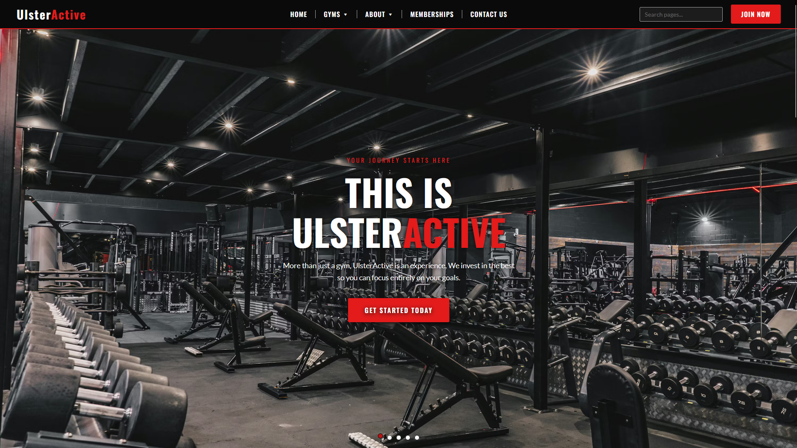
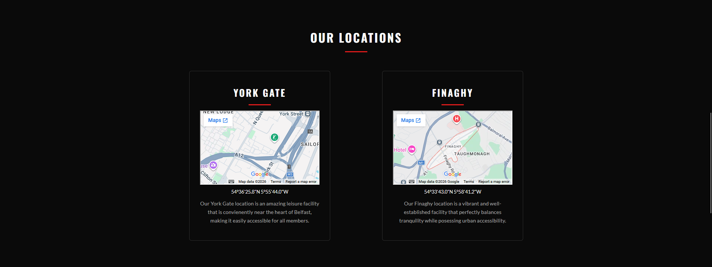
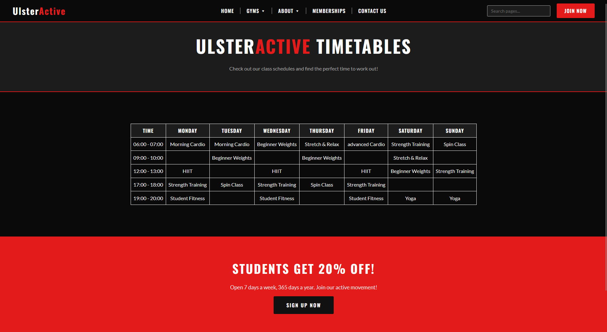
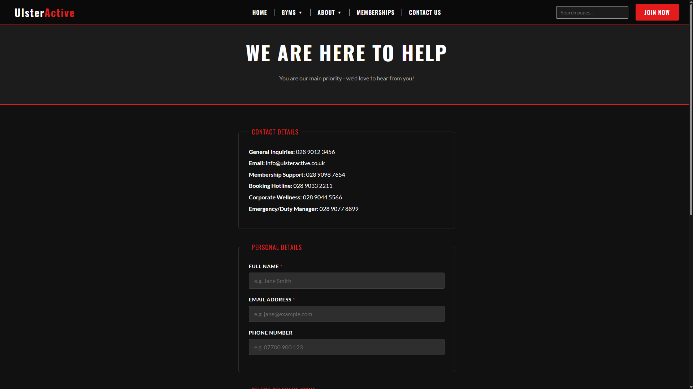
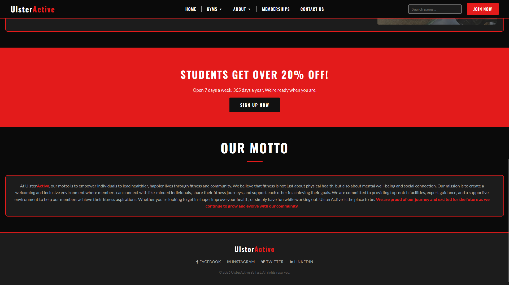
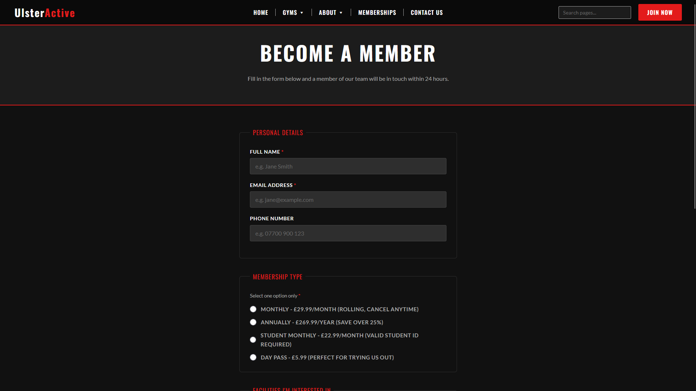

# UlsterActive Frontend Project

UlsterActive is a static frontend website project designed to showcase gym facilities, locations, memberships, timetables, and contact information.

The website is built using **HTML5, CSS3, and JavaScript**, with supporting images and video content.

## Project Preview

The project includes preview screenshots demonstrating the main sections of the UlsterActive website.

## Website Preview Samples

### UlsterActive Homepage



### Locations



### Timetable



### Contact Us



### About



### Become a Member



## Project Structure

```text
UlsterActive-FrontendProject-main/
│
├── home.html
├── README.md
│
├── CSS/
│   └── styles.css
│
├── Images/
│   ├── aboutFinalImage.jpg
│   ├── aboutGym1.jpg
│   ├── Favicon.ico
│   ├── featureCard1.jpg
│   ├── featureCard2.jpg
│   ├── featureCard3.jpg
│   ├── finaghycardio.jpg
│   ├── finaghyweightroom.jpg
│   ├── general-img-square.png
│   ├── greeterBackground1.jpg
│   ├── greeterBackground2.jpg
│   ├── greeterBackground3.jpg
│   ├── greeterBackground4.jpg
│   ├── greeterBackground5.jpg
│   ├── Gym.jpg
│   ├── locationCard1.jpg
│   ├── MainDesign.png
│   ├── yorkgateGymShowcase.jpg
│   └── yorkgateYogaShowcase.png
│
├── JavaScript/
│   ├── checkContact.js
│   ├── checkMembership.js
│   ├── homePageScripts.js
│   └── searchbar.js
│
├── Previews/
│   ├── BecomeAMemberSample.png
│   ├── BottomAboutSample.png
│   ├── ContactUsSample.png
│   ├── LocationsSample.png
│   ├── TimeTableSample.png
│   └── UlsterActiveSample.png
│
├── Videos/
│   ├── FinaghyGymFlyThrough.mp4
│   └── YorkgateGymFlyThrough.mp4
│
└── Webpages/
    ├── about.html
    ├── contact.html
    ├── finaghy.html
    ├── membership.html
    ├── timetables.html
    └── yorkgate.html
```

## Website Pages

The project contains the following webpages:

| Page | File | Description |
|---|---|---|
| Home | `home.html` | Main landing page for the UlsterActive website |
| About | `Webpages/about.html` | Information about UlsterActive and its facilities |
| Contact | `Webpages/contact.html` | Contact information and contact functionality |
| Finaghy | `Webpages/finaghy.html` | Information and showcase for the Finaghy gym |
| Membership | `Webpages/membership.html` | Membership information and membership-related functionality |
| Timetables | `Webpages/timetables.html` | Gym/class timetable information |
| Yorkgate | `Webpages/yorkgate.html` | Information and showcase for the Yorkgate gym |

## Technologies Used

- **HTML5** - Website structure and content
- **CSS3** - Layout, styling, and responsive presentation
- **JavaScript** - Interactive functionality and form/search behaviour
- **Draw.io** - Wireframes and initial website design planning

## JavaScript

The `JavaScript` folder contains the scripts used to provide interactive functionality throughout the website:

- `homePageScripts.js` - Homepage interactions and functionality
- `searchbar.js` - Website search functionality
- `checkContact.js` - Contact-related validation/functionality
- `checkMembership.js` - Membership-related validation/functionality

## Images and Media

The `Images` folder contains the visual assets used throughout the website, including:

- Gym and facility photographs
- Location images
- Feature-card images
- Background images
- Showcase images
- Website favicon
- Design/reference assets

The `Videos` folder contains gym fly-through videos for:

- **Finaghy Gym**
- **Yorkgate Gym**

## How to Run

This is a static frontend website and does not require a backend server.

### Option 1 - Open Directly

1. Download or clone the repository.
2. Open the project folder.
3. Open `home.html` in a modern web browser.

### Option 2 - Use a Local Development Server

For a more reliable development environment, open the project in an editor such as Visual Studio Code and use a local development server, such as the **Live Server** extension.

Then open the local address provided by the development server in your browser.

## Getting Started

After opening the project, `home.html` acts as the main entry point to the website.

The website's supporting pages are located in:

```text
Webpages/
```

Styling is contained in:

```text
CSS/styles.css
```

JavaScript functionality is contained in:

```text
JavaScript/
```

Images and other visual assets are contained in:

```text
Images/
```

and video assets are contained in:

```text
Videos/
```

## Development

When modifying the website:

- Update HTML files for page structure and content.
- Update `CSS/styles.css` for styling and layout.
- Update the relevant JavaScript file when changing interactive functionality.
- Keep images in the `Images/` directory.
- Keep videos in the `Videos/` directory.
- Keep page-specific HTML files in the `Webpages/` directory.
- Keep preview screenshots in the `Previews/` directory.

## Project Design

The website was planned using wireframes created in **Draw.io** before being implemented with HTML, CSS, and JavaScript.

The `Images/MainDesign.png` file contains a design/reference asset used during the development of the project.

## License

This project was created as a frontend web development project for UlsterActive. No separate open-source license is currently specified.
